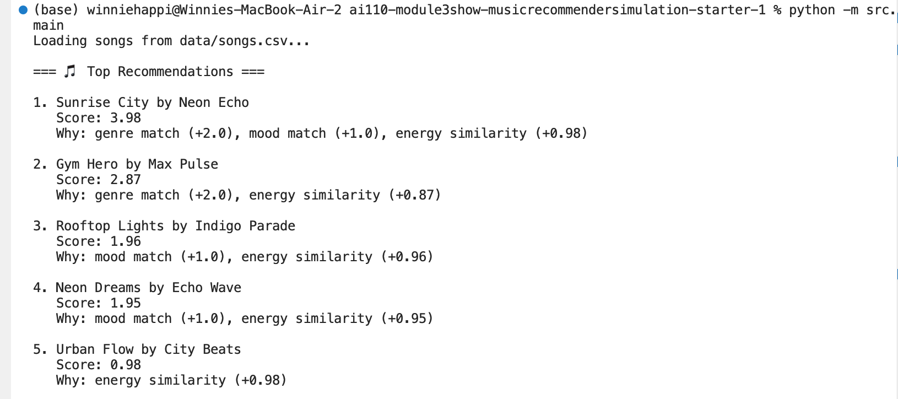
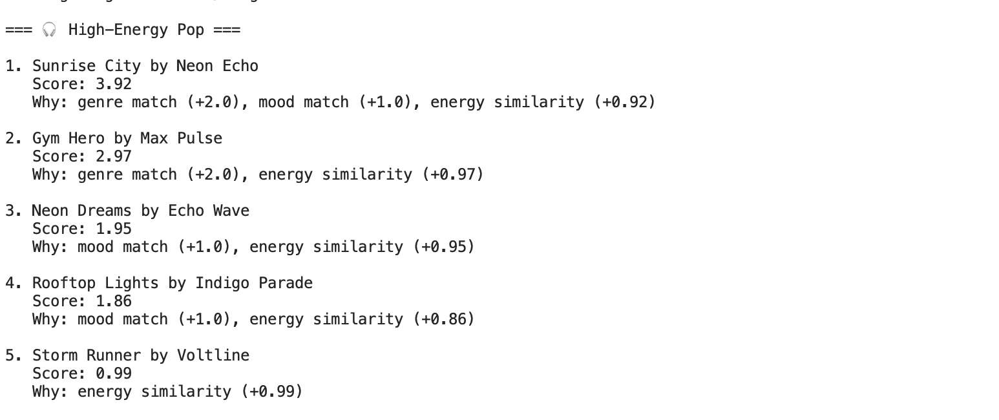
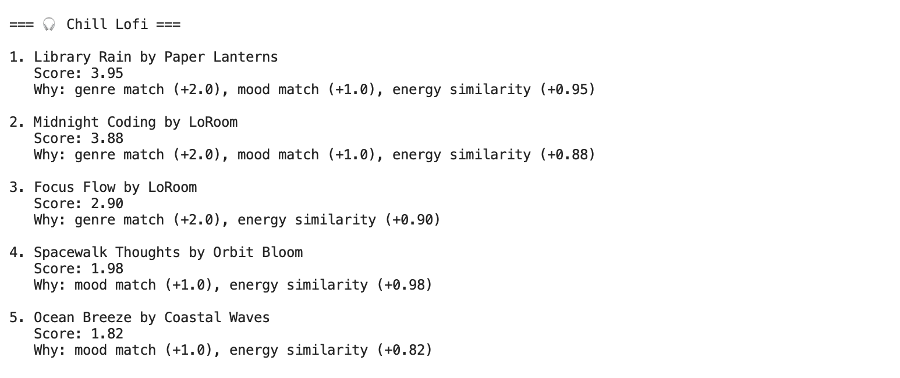
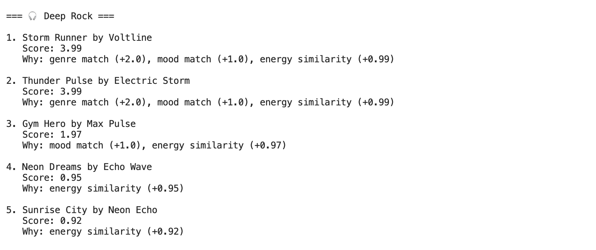
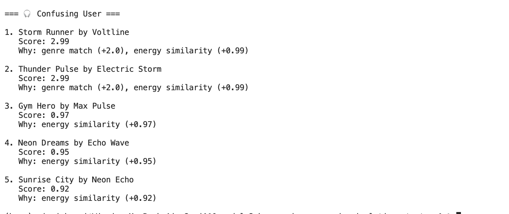

# 🎵 Music Recommender Simulation

## Project Summary

This project builds a simple music recommender system that suggests songs based on a user’s preferences.

The system:
- Represents songs and user preferences as data  
- Scores songs based on similarity to user taste  
- Ranks songs and returns the top recommendations  
- Evaluates strengths, weaknesses, and biases  

---

## How The System Works

Each song includes features such as:
- genre  
- mood  
- energy  
- tempo_bpm  
- valence  
- danceability  
- acousticness  

The user provides preferences:
- favorite genre  
- favorite mood  
- target energy  
- acoustic preference  

### Scoring Logic

Each song receives a score based on:

- +2.0 if genre matches  
- +1.0 if mood matches  
- Energy similarity using:  
  `1 - |song.energy - user.energy|`  
- Acoustic preference (adds or subtracts based on user)  

Songs are then sorted from highest to lowest score, and the top K songs are returned.

---

## System Flow

Input: User preferences + songs from CSV  
↓  
Process: Score each song  
↓  
Ranking: Sort by score  
↓  
Output: Top K recommendations  

---

## Potential Biases

- Genre is heavily weighted → may dominate results  
- Energy similarity can reduce diversity  
- Conflicting preferences are not handled well  
- Small dataset limits variety  
- Acoustic preference can skew toward certain styles  

---

## CLI Output Example



---

## Stress Test Results

### High-Energy Pop


### Chill Lofi


### Deep Rock


### Edge Case (Confusing User)


---

## Accuracy and Observations

Most recommendations matched expectations.

- **High-Energy Pop** → energetic pop songs ranked highest  
- **Chill Lofi** → calm, low-energy songs appeared  
- **Deep Rock** → intense rock songs dominated  

### Interesting Findings

- Some songs (like *Gym Hero*) appear across profiles  
- Energy similarity strongly affects ranking  
- Conflicting preferences rely mostly on energy  

Example:
- A user wanting *rock + sad + high energy* still got energetic rock songs  
- Mood mismatch was not strongly penalized  

---

## Small Data Experiment

I changed the weights:
- Reduced genre importance  
- Increased energy importance  

### Result

- Energy became dominant  
- Songs with similar energy ranked highest  
- Genre mattered less  

This made the system more flexible but less accurate for genre-based preferences.

---

## Getting Started

### Setup

```bash
python -m venv .venv
source .venv/bin/activate
pip install -r requirements.txt